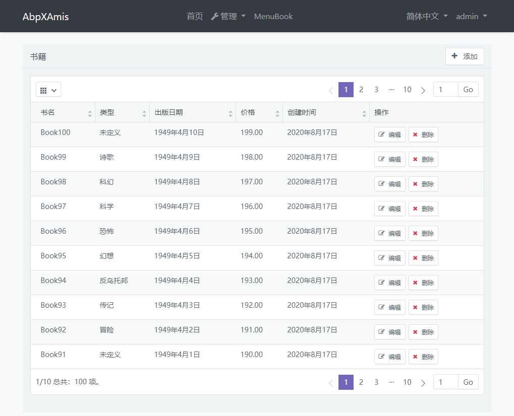

# AbpXAmis

一个[ABP](https://github.com/abpframework/abp)集成[AMIS](https://github.com/baidu/amis)的演示程序

# 版本信息

* ABP 3.0.5
* AMIS 1.0.14

# 简介

ABP(ABP vNext)是ASP.NET Core下一个非常优秀的Web框架, 具有优雅的架构和灵活的扩展性.

AMIS是一个前端低代码框架，通过 JSON 配置就能生成各种后台页面，极大减少开发成本，甚至可以不需要了解前端。

AMIS内置了很多组件, 非常适合开发企业应用(如管理后台). 而这也是我认为ABP(目前)所欠缺的东西.

所以我试着在ABP中集成AMIS, 创建了这个演示应用程序, 看看两个优秀的框架的结合能否迸发出更强大的力量.

# 演示内容

演示程序仿造了ABP官方的[书籍管理教程](https://docs.abp.io/en/abp/latest/Tutorials/Part-1?UI=MVC&DB=EF), 实现了书籍信息完整的CRUD功能.

其中后端使用ABP标准的开发方式, 提供书籍相关的API. 前端利用MVC/Razor Pages创建了一个书籍入口页面, 而其余的前端功能则完全使用AMIS来实现.

主要演示功能:

* 使用AMIS的CRUD组件显示书籍的一览列表
  * 分页
  * 排序
* 使用AMIS的表单实现书籍的创建和编辑功能

程序还演示了一些值得注意的特性:

* 如何在AMIS中判断ABP权限
* 如何在AMIS中使用ABP的本地化系统
* 如何使用AMIS的[数据格式映射](https://baidu.gitee.io/amis/docs/concepts/data-mapping)来兼容ABP API的格式

# 结论

通过这个演示程序, 能看到ABP与AMIS可以比较容易的结合. 当然如果想达到完美的程度, 还需要做一些"胶水"类的辅助(比如调用ABP API需要映射数据格式, 本地化与AMIS的模板兼容的小问题), 这些可以通过创建ABP的模块来提供, 该模块还可以包含一个AMIS的JSON管理功能, 甚至集成AMIS的[可视化编辑器](https://github.com/fex-team/amis-editor), 来实现动态页面和动态表单的功能.

总之, 结合ABP强大的后端和AMIS丰富的前端组件, 应用前景十分广阔. 是企业应用开发, 尤其对于国内项目, 是非常有潜力的组合.
